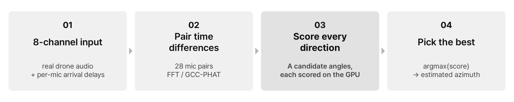

# drone-doa-gpu

**GPU-parallel acoustic direction finding for drones.** An 8-microphone array hears a drone; every candidate
direction is scored in parallel on the GPU, and the highest score gives the drone's azimuth. The project asks
how much of this pipeline has to move to the GPU before the *whole* system gets faster, and how many microphone
arrays a single GPU can then handle in real time.

[](LICENSE)


<p align="center"></p>

## Why

Illegal drone flights near airports are a real operational problem. Around Incheon, Gimpo, and Jeju airports,
**1,165** illegal drones were detected or reported between 2021 and August 2026, and **207** flights were
disrupted by airspace intrusions (Korea Ministry of Land, Infrastructure and Transport, as of August 2026).

Once a drone is detected, a camera or countermeasure needs its **direction, in real time**. A microphone array
provides it from the tiny arrival-time differences between microphones. A monitoring site has many arrays, and
one server should process all of them within one audio frame (42.7 ms). The direction scan maps naturally to
the GPU (1 thread = one frame × one candidate angle), but preprocessing, transfers, and launch overheads decide
whether the GPU actually helps.

## Phases

<p align="center"></p>

| Phase | Question | Status | Document |
|---|---|---|---|
| **1. GPU direction finding** | How far must the computation move to the GPU for end-to-end real-time performance to improve? | Done | [Phase 1 results](docs/phase1.md) |
| **2. Kernel optimization** | Where does the remaining GPU time go, and how many more arrays does removing it buy? | Next | [Phase 2 plan](docs/phase2_plan.md) |
| 3. Detection + direction runtime | Can one shared STFT feed both Log-Mel drone detection and direction finding across many arrays? | Later | [Roadmap](docs/roadmap.md) |

## Phase 1 result

<p align="center"></p>

Measured on a Colab Tesla T4 (graph: 64 frames × 1,440 candidate directions per batch):

- The GPU scan beats the CPU from about **340** candidate directions.
- Moving only the scan gives **1.11×**: GCC-PHAT preprocessing on the CPU still dominates (Amdahl bound 1.16×).
- Moving the whole pipeline cuts **99.4 ms to 2.58 ms** (38.5×), and to **1.89 ms** (52.6×) with pinned input.
- Real-time capacity (p95 ≤ 42.7 ms) grows from **16 to 1,024 arrays** per GPU.

**Next — Phase 2.** Inside the full-GPU pipeline the direction scan is now only 6% of the time; an IFFT whose
output is almost entirely discarded takes 46%, and the audio upload another 20%. Phase 2 removes these costs
segment by segment (lag DFT instead of IFFT, int16 + overlapped transfer, smaller FFT, CUDA Graph) and measures
how many more arrays each step buys. See the [Phase 2 plan](docs/phase2_plan.md).

## Repository layout

```text
docs/                      Phase write-ups and plans (phase1.md, phase2_plan.md, roadmap.md), README images
experiments/
  phase1_gpu_doa/          Phase 1 notebook (.py source + generated .ipynb), design notes, results, report
src/drone_doa/             Shared Python package for code reused across phases
tests/                     Tests for src/
tools/                     Notebook converter, GPU-free dry-run runner (fakecupy), diagram generator
data/                      Local datasets (git-ignored)
```

## Quick start

Open [`experiments/phase1_gpu_doa/phase1_doa_scan.ipynb`](experiments/phase1_gpu_doa/phase1_doa_scan.ipynb) in
Google Colab, select a **T4 GPU** runtime, and run all cells (about 10 minutes). The drone clips are downloaded
automatically. To edit the notebook, change the `.py` source and regenerate:

```bash
python3 tools/py2nb.py experiments/phase1_gpu_doa/phase1_doa_scan.py experiments/phase1_gpu_doa/phase1_doa_scan.ipynb
```

A GPU-free dry run (logic and figures only, timings meaningless) is described in the
[Phase 1 experiment README](experiments/phase1_gpu_doa/README.md).

## Data and license

Code and documentation are released under the [MIT License](LICENSE).

The drone recordings come from DroneAudioDataset (S. A. Al-Emadi, A. K. Al-Ali, A. Al-Ali, A. Mohamed,
"Audio Based Drone Detection and Identification using Deep Learning," IWCMC 2019). The dataset is published
without a license, so the recordings are downloaded at run time and are not redistributed in this repository.
