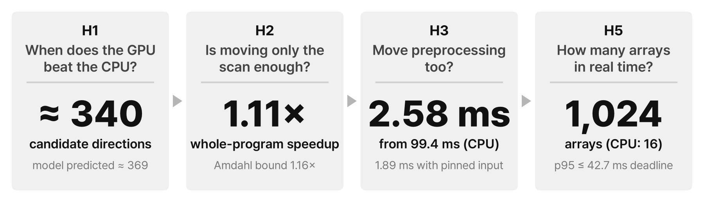
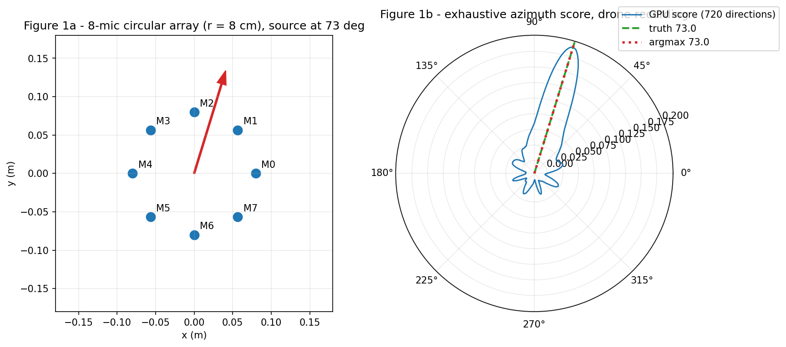
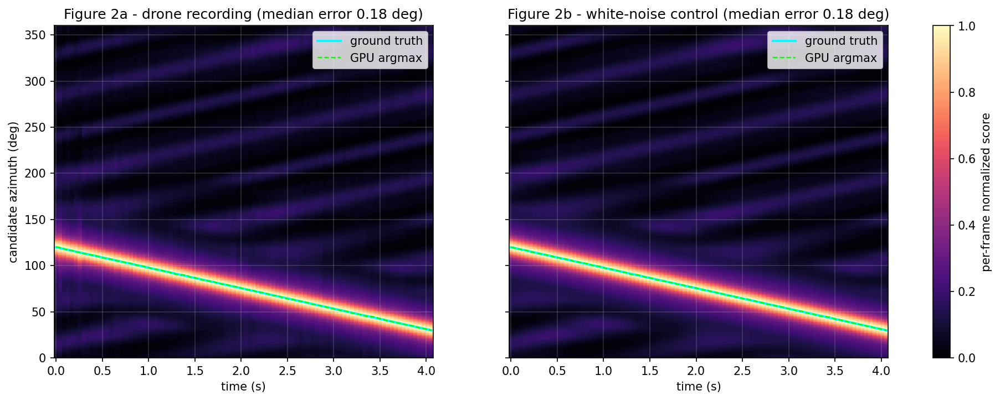
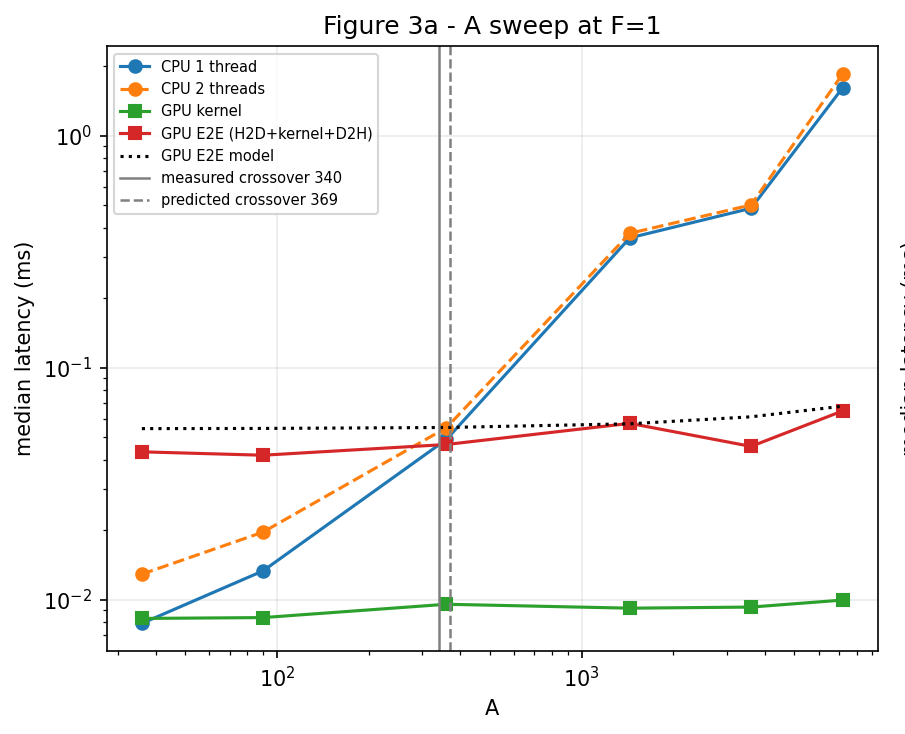
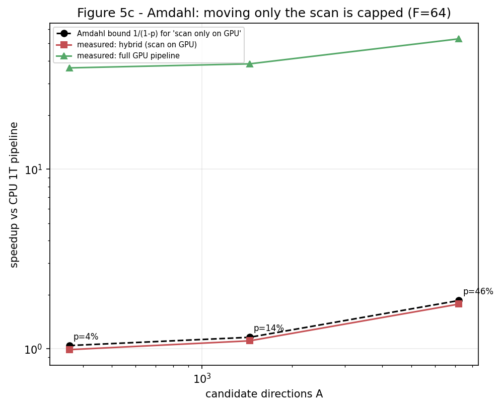
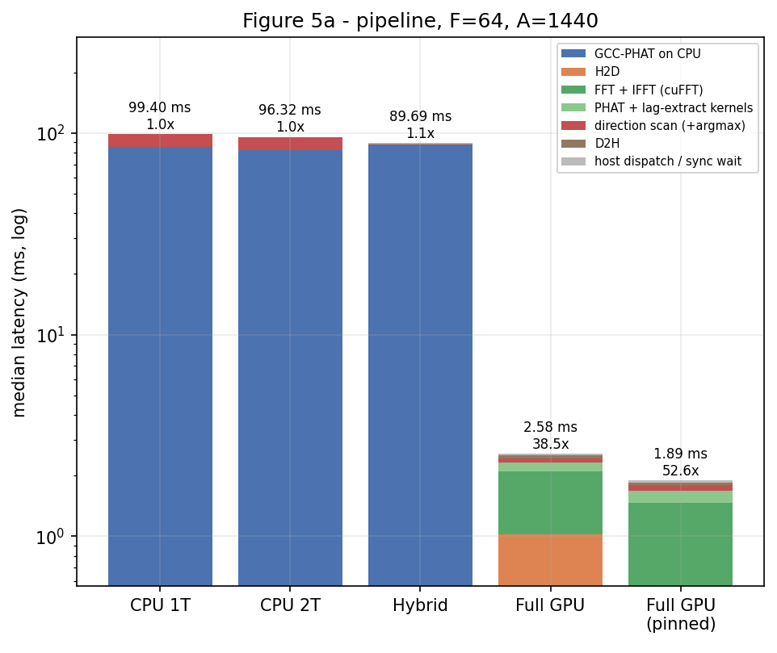
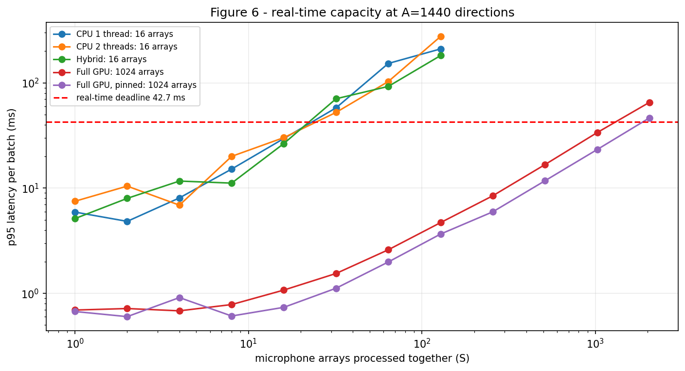
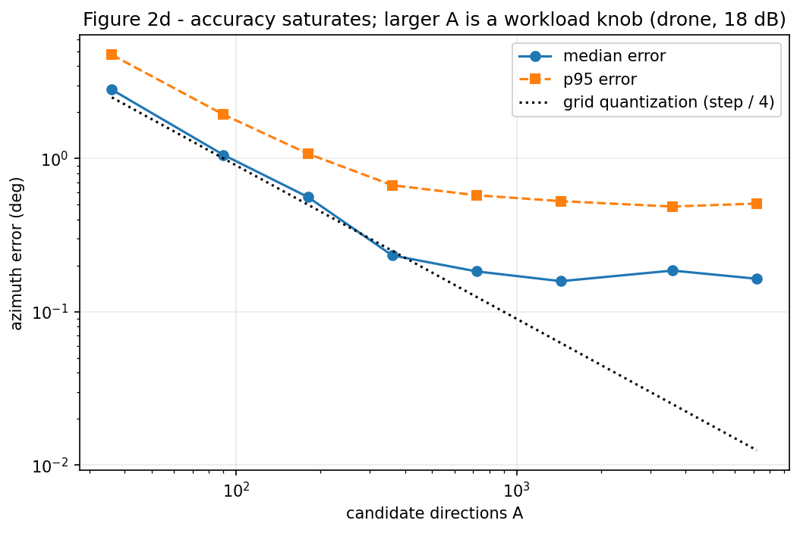
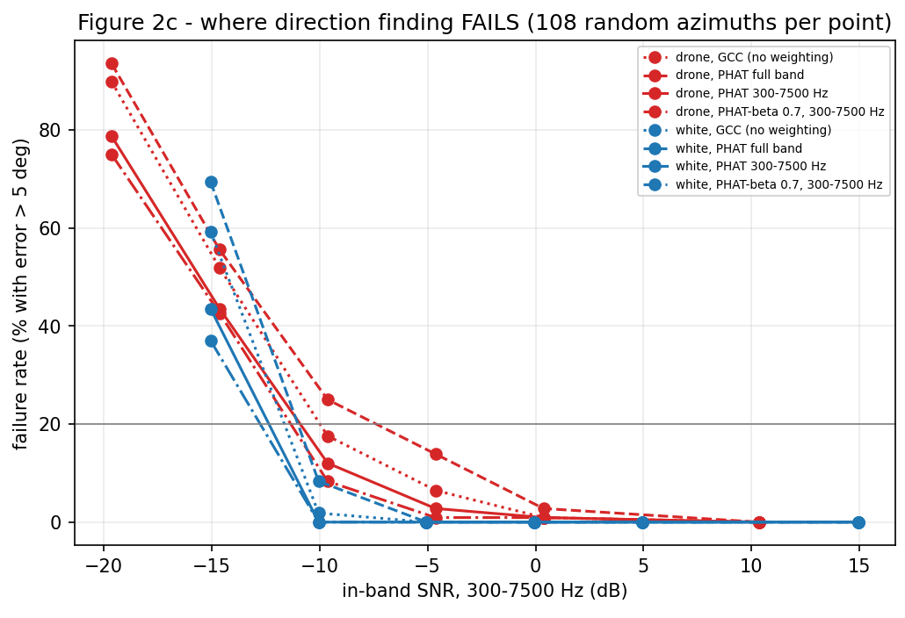

# Phase 1 — How far must the work move to the GPU?

**Status:** done (2026-10-02, Colab Tesla T4) ·
**Code:** [`experiments/phase1_gpu_doa/`](../experiments/phase1_gpu_doa/) ·
**Design & protocol:** [`design.md`](../experiments/phase1_gpu_doa/design.md) ·
**Raw results:** [`results/colab-t4_2026-10-02/`](../experiments/phase1_gpu_doa/results/colab-t4_2026-10-02/) ·
**Interim report (Korean, PDF):** [`phase1_interim_report.pdf`](../experiments/phase1_gpu_doa/report/phase1_interim_report.pdf)

The direction scan is easy to parallelize — 1 GPU thread = (frame, candidate angle) — but whether the *whole*
system gets faster depends on everything around it. Phase 1 follows one chain of questions; each answer raises
the next one.

**Setup.** Real Parrot Bebop propeller recordings ([DroneAudioDataset](https://github.com/saraalemadi/DroneAudioDataset))
with synthetic delays for an 8-mic circular array (r = 8 cm) · 48 kHz, 2048-sample frames (42.7 ms deadline) ·
custom CUDA kernels via CuPy `RawKernel`, cuFFT for FFTs · CPU baselines in NumPy/SciPy + Numba ·
Google Colab, Tesla T4, 2 vCPUs.

## 1. Score every direction, verify against the CPU

Each frame goes through FFT → GCC-PHAT for 28 mic pairs → a score for each of A candidate directions →
argmax. The GPU result must match a CPU reference (scores `allclose`, identical argmax) before anything is
timed, and two deliberately broken variants (sign-flipped delay table, off-by-one interpolation) must be caught
as FAIL.

  
  

The true direction (73°) and the GPU's best score (73°) coincide over 720 candidates, and a drone moving from
120° to 30° is tracked with a 0.18° median error — for both the drone recording and a white-noise control.

## 2. Hypotheses, fixed before measuring

| | Question | Prediction | Criterion | Verdict |
|---|---|---|---|---|
| H1 | When does the GPU win? | GPU fixed costs dominate small jobs; the GPU overtakes as candidates grow | Measured crossover within 0.5–2× of the model | ✅ Supported |
| H2 | Is moving only the scan enough? | Overall speedup is capped by the scan's share (Amdahl) | Measured ≤ Amdahl bound; bound grows with A | ✅ Supported |
| H3 | Full GPU: new bottleneck? | H2D or FFT becomes the largest segment | Largest segment of the timing breakdown | ✅ Supported |
| H4 | Does the delay-table layout matter? | `[A][P]` vs `[P][A]` differ by < 1.2× | Kernel time ratio | ❌ Rejected (1.227×) |
| H5 | Real-time capacity? | Full GPU handles ≥ 10× the arrays of the best CPU | Arrays with p95 ≤ 42.7 ms | ✅ Supported (64×) |
| H6 | Does the input affect accuracy? | Drone audio is harder; band-limiting PHAT helps | Angle error and failure rate per condition | ✅ Supported |

Timing protocol: warm-up, then ≥ 10 repetitions, median reported; real-time verdicts use p95. Kernels are timed
with CUDA Events (queued behind a spin kernel to exclude launch gaps), end-to-end paths with a host timer.

## 3. H1 — the GPU wins from about 340 candidate directions

With one frame, few directions are cheaper on the CPU: the GPU pays a fixed ~0.05 ms for transfers and launch.
As candidates grow, CPU time scales linearly while GPU end-to-end time stays almost flat. **Measured crossover
A ≈ 340 vs. 369 predicted** by a two-term fixed-cost model (ratio 0.92×).

*So the scan itself is a good GPU workload — but does moving just the scan speed up the whole program?*

## 4. H2 — moving only the scan gives just 1.11×

At A = 1,440 the scan is only **14%** of the CPU pipeline; GCC-PHAT preprocessing is the rest. Even an
infinitely fast scan could give at most **1.16×** — the hybrid measured **1.11×**. The bound and the measured
speedup grow together with A (p = 4% → 46%, bound 1.04× → 1.86×), but the scan alone never pays off.

*The bottleneck is the CPU preprocessing — what happens when it moves to the GPU as well?*

## 5. H3 — full GPU: 99.4 ms → 2.58 ms, the new bottleneck is H2D + FFT

| F = 64, A = 1,440 | Total | H2D | FFT + IFFT | Rest |
|---|---|---|---|---|
| CPU 1 thread | 99.40 ms | – | – | – |
| Hybrid (scan on GPU) | 89.69 ms | – | – | – |
| Full GPU | **2.58 ms** (38.5×) | 1.02 ms | 1.09 ms | 0.47 ms |
| Full GPU, pinned input | **1.89 ms** (52.6×) | 0.37 ms | 1.09 ms | 0.43 ms |

With everything on the GPU, the scan is no longer the issue: **audio upload (H2D) and FFT/IFFT** are the
largest segments. A pinned input buffer cuts H2D from 1.02 to 0.37 ms.

*Faster per batch — but what does that buy a real-time monitoring system?*

## 6. H5 — real-time capacity grows from 16 to 1,024 arrays

Capacity = the largest number of arrays whose same-instant frames are processed with **p95 ≤ 42.7 ms**.
CPU and hybrid pipelines stop at **16 arrays**; the full-GPU pipelines reach **1,024 arrays** (64×), with p95
of 33.72 ms (pageable) and 23.26 ms (pinned) at 1,024 arrays.

## 7. Further checks — memory layout and accuracy

  
  

- **H4 (rejected):** the `[A][P]` delay-table layout was 1.227× slower than `[P][A]`, more than the < 1.2×
  predicted. The cause is investigated in [Phase 2](phase2_plan.md).
- **Resolution:** median error is 0.23° at 360 directions and 0.18° at 720, then saturates at ~0.16–0.19°.
  Larger A is therefore a workload knob (standing in for an azimuth × elevation grid), not extra accuracy.
- **H6:** at equal in-band SNR the drone is harder than white noise (20% failure at −10.9 vs −12.3 dB), and
  band-limited PHAT fails less than full-band PHAT on the drone (23.0% vs 31.8% mean failure rate).

## Scope of the numbers

- The crossover's GPU end-to-end time covers correlation upload → scan → score download (no FFT, no argmax);
  A ≈ 340 is interpolated between measured points.
- Pipeline times run from a prepared batch in host memory to the result indices on the host. Per-segment
  medians do not sum exactly to the total median.
- 1,024 arrays is the largest passing power of two in a compute benchmark that reuses 96 prepared frames;
  sensor capture, networking, and queuing are not included.
- Array delays and noise are synthetic: no reverberation, Doppler, or real multichannel field recordings yet.
- Single Colab T4 session.

**Next:** the pinned full-GPU pipeline spends 46% of its time in an IFFT whose output is 98.8% discarded —
see the [Phase 2 plan](phase2_plan.md).
