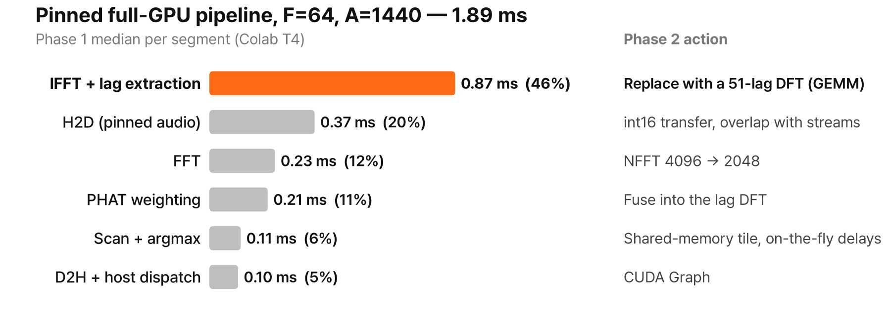

# Phase 2 plan — Kernel optimization

**Status:** planned · **Builds on:** [Phase 1](phase1.md) · **Code (to be created):** `experiments/phase2_kernel_opt/`

## Goal

Make the full-GPU direction-finding pipeline faster **where the time actually goes**, and turn each speedup into
real-time capacity: more microphone arrays per GPU under the same p95 ≤ 42.7 ms deadline.

Phase 1 showed that optimizing the most parallel part first does not pay off (Amdahl, H2). The same lesson
applies inside the GPU pipeline. In the pinned full-GPU pipeline the direction-scan kernel takes only 6% of
the time, while an IFFT whose output is almost entirely discarded takes 46%:

Phase 2 therefore works through the segments by size, not by how interesting the kernel is.

## Where the time goes (Phase 1 reference run, pinned input, medians)

| Segment | F=64, A=1,440 | F=1,024, A=1,440 | Why it is large |
|---|---|---|---|
| IFFT + lag extraction | 0.87 ms (46%) | 13.42 ms (50%) | 4096-point IFFT for each of 28 pairs, but only 51 lags (1.2% of the output) are used |
| H2D (audio) | 0.37 ms (20%) | 5.48 ms (20%) | float32 audio, 4 MB per 64 frames; no overlap with compute |
| FFT | 0.23 ms (12%) | 3.25 ms (12%) | each 2048-sample frame is zero-padded to 4096 points |
| PHAT weighting | 0.21 ms (11%) | 3.19 ms (12%) | writes a full `[F, 28, 2049]` complex cross-spectrum, though only band bins are non-zero |
| Scan + argmax | 0.11 ms (6%) | 1.49 ms (6%) | scan reads the delay table and correlations from global memory |
| D2H + host dispatch | 0.10 ms (5%) | 0.12 ms (0.5%) | ~10 separate launches per batch; matters at small F |
| **Total** | **1.89 ms** | **26.92 ms** | |

## Hypotheses

Each hypothesis is fixed before measuring, with a numeric prediction derived from the Phase 1 numbers.

| ID | Change | Prediction | Criterion |
|---|---|---|---|
| P2-H1 | **Replace IFFT + extraction with a 51-lag DFT** over the 614 in-band bins (300–7500 Hz), as one complex GEMM `[F·28, K_band] × [K_band, 51]` | About 0.45 GFLOP and 9 MB at F=64 → this segment drops from 0.87 ms to ≤ 0.2 ms | Segment time ≤ 0.2 ms; correlations match the CPU reference (relative error ≤ 1e-4) |
| P2-H2 | **Fuse PHAT into the lag DFT** (cross-spectrum and weighting computed on the fly, never written to memory) | The 0.21 ms PHAT segment disappears; the fused kernel costs no more than the unfused GEMM | Fused time ≤ GEMM-only time |
| P2-H3 | **NFFT 4096 → 2048** (circular correlation) | Aliasing only affects lags near ±2048, where the Hann window is ~0, so accuracy is unchanged while the FFT halves | FFT time ≤ 0.6× Phase 1; correctness gate passes; median error at 18 dB within ±0.05° and failure rate within ±2 pp at every SNR |
| P2-H4 | **int16 audio transfer** (convert + window on the GPU) **and stream double-buffering** | H2D bytes halve (0.37 → ~0.19 ms); with two streams, the next batch's upload hides behind the current batch's compute | H2D ≤ 0.6× Phase 1; in the streaming benchmark, throughput is limited by compute, not H2D |
| P2-H5 | **Explain the H4 rejection.** `[A][P]` slowed as the block grew (0.335 → 0.436 ms, blocks 64 → 1024) while `[P][A]` stayed flat (~0.275 ms). Each block's slice of the `[A][P]` table is `block × 112 B` (28 KB at 256, 112 KB at 1024), so it no longer fits in L1 | L1 hit rate for `[A][P]` falls as the block grows; `[P][A]` stays flat | Nsight Compute L1 hit rate and sectors per request vs. block size |
| P2-H6 | **Scan kernel:** correlation tile (28 × 51 floats = 5.7 KB) in shared memory and **on-the-fly delays** (one `sincosf` per thread, then 2 FMAs per pair instead of a table read) | Removes the delay-table traffic entirely; ≥ 1.5× faster than Phase 1's best layout at F=256, A=3,600, and ≥ 1.5× at A=7,200 | Kernel time (spin-queued Events) |
| P2-H7 | **CUDA Graph** for the whole fixed-shape pipeline | Removes per-launch host dispatch; F=1 end-to-end latency drops by ≥ 20% | F=1 median and p95 end-to-end |
| P2-H8 | **Frequency-domain SRP-PHAT** (`Σ_p Σ_k Re(G_p[k]·e^{jω_k τ_p(a)})` as a GEMM `[F, 28·K_band] × [28·K_band, A]`) vs. the lag-DFT path | Compute-bound and ∝ A (~8.8 MFLOP per candidate at F=64), while the lag path is mostly fixed cost. Predicted crossover A ≈ 50: frequency domain wins only below it | Measured crossover within 2× of prediction; both placed on a T4 roofline |
| P2-H9 | **All of the above combined** | F=64, A=1,440 pinned: 1.89 → ≤ 0.9 ms. Real-time capacity: 1,024 → ≥ 4,096 arrays | End-to-end median; capacity with p95 ≤ 42.7 ms |

The capacity estimate for P2-H9 scales the per-segment predictions to F=1,024 (≈ 9 ms instead of 26.9 ms),
which projects to ≈ 36 ms at 4,096 arrays: inside the 42.7 ms deadline, but with little margin for p95.

## Work plan

| Step | Work | Output |
|---|---|---|
| 0. Shared code | Move the Phase 1 harness, signal synthesis, CPU reference, and kernels into `src/drone_doa/`. Add tests (CPU reference vs. fakecupy kernels). Re-run the Phase 1 pipeline in the Phase 2 session as the **same-session baseline** | Package + tests; baseline CSV |
| 1. Profile | Nsight Systems timeline of the pinned pipeline (F=64 and F=1,024); Nsight Compute on `scan_ap`, `scan_pa`, `cross_phat` | Profiles; confirms the segment ranking |
| 2. Remove the IFFT | Lag DFT via cuBLAS CGEMM (`cupy.matmul`), then a fused PHAT + lag-DFT RawKernel; NFFT 2048 | P2-H1, H2, H3 |
| 3. Transfers | int16 pinned ring buffer, on-GPU convert + window, two-stream double buffering | P2-H4 |
| 4. Scan kernel | `[P][A]` baseline → shared-memory tile → on-the-fly delays → fused argmax; block-size sweep; L1 metrics | P2-H5, H6 |
| 5. Dispatch | CUDA Graph capture and replay of the full pipeline | P2-H7 |
| 6. Alternative formulation | Frequency-domain SRP-PHAT GEMM vs. the lag path over A; T4 roofline | P2-H8 |
| 7. Combine and report | Ablation (each optimization on/off), capacity sweep, accuracy re-check, `docs/phase2.md` | P2-H9; write-up |

## Method (carried over from Phase 1)

- **Correctness first:** every variant passes the Phase 1 gate (CPU reference allclose, argmax match, static
  error ≤ 3°) and both negative controls before it is timed. Accuracy experiments are re-run for any change
  that alters the numerics (NFFT, lag DFT).
- **Same-session baseline:** Phase 1 and Phase 2 pipelines are measured in the same Colab session, so the
  comparison does not depend on session-to-session variance.
- **Timing:** spin-queued CUDA Events for kernels, host timer for end-to-end; warm-up, ≥ 10 repetitions,
  median, p95 for real-time verdicts; shuffled condition order; GPU clocks logged.
- **Ablation:** each optimization is reported as its own row (Phase 1 pipeline + that change only) and as part
  of the combined pipeline, so each contribution is visible.
- **Results:** `experiments/phase2_kernel_opt/results/<env>_<date>/`, same CSV schema as Phase 1 where possible.

## Risks

| Risk | Mitigation |
|---|---|
| Nsight Compute performance counters may be blocked on Colab (`ERR_NVGPUCTRPERM`) | Run profiling on another T4 host (e.g. Kaggle, a cloud VM); on Colab, fall back to Event timing and block-size / layout sweeps |
| cuBLAS CGEMM may be inefficient for the narrow N=51 shape | Batched GEMM over pairs, or a custom tiled kernel (step 2 compares both) |
| NFFT 2048 could change accuracy at low SNR | Treat P2-H3 as rejected if the accuracy criterion fails; keep NFFT 4096 for the rest |
| Colab T4 availability and clock variation | Same-session baseline, logged clocks, repeated sessions for the final numbers |

## Out of scope

Drone detection (Log-Mel), the shared STFT runtime, real multichannel recordings, and 2D azimuth × elevation
search belong to Phase 3. A = 3,600 and 7,200 remain proxies for 2D grid sizes.
