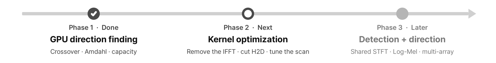

# Roadmap

<p align="center"></p>

Goal: a real-time acoustic drone-monitoring runtime in which **one STFT feeds both detection and direction finding**.

```text
multichannel audio stream (pinned ring buffer)
   └─ STFT (complex) ── computed once, resident on the GPU
        ├─ |X|² → Mel matmul → log → Log-Mel → drone / non-drone      (detection)
        └─ X_i·conj(X_j) → weighting → lag DFT → GCC → direction scan  (localization)
```

| Phase | Status | Scope |
|---|---|---|
| 1. Direction finding on the GPU | Done (2026-10-02) | Scan kernel, CPU/GPU crossover model, Amdahl analysis, GCC-PHAT on the GPU, real-time capacity. See [Phase 1 results](phase1.md) |
| 2. Kernel optimization | Next | Remove the 4096-point IFFT (51-lag DFT, fused with PHAT), NFFT 2048, int16 transfers with stream double-buffering, shared-memory scan with on-the-fly delays, CUDA Graph, frequency-domain SRP-PHAT vs. lag path on a roofline, explain the `[A][P]` layout result with Nsight Compute. Target: ≥ 4,096 arrays per T4. See [Phase 2 plan](phase2_plan.md) |
| 3. Detection + direction runtime | Later | Shared STFT (parameter compromise: classifiers usually use 16 kHz / 25 ms windows, direction finding 48 kHz / 2048 points); Log-Mel branch (custom kernel vs. cuBLAS); drone / non-drone classifier (DroneAudioDataset `unknown` class); multi-array streaming; azimuth × elevation 2D search and coarse-to-fine search; validation on real multichannel recordings (UaVirBASE: needs array geometry and channel-order metadata first); better weightings (SCOT, learned); multi-session p95 capacity; performance regression tests |

Notes carried over from Phase 1:

- Constant memory is the wrong home for the delay table: constant cache broadcasts only when every thread in a
  warp reads the same address, but in the (frame, angle) mapping each thread reads a different angle, so
  accesses serialize.
- Already in place for later phases: the complex spectrum is computed once on the GPU (`gpu_fft` → `gpu_cross`),
  a weighting-mode interface, the measurement harness and CSV schema, the correctness gate with negative
  controls, and the capacity metric.
